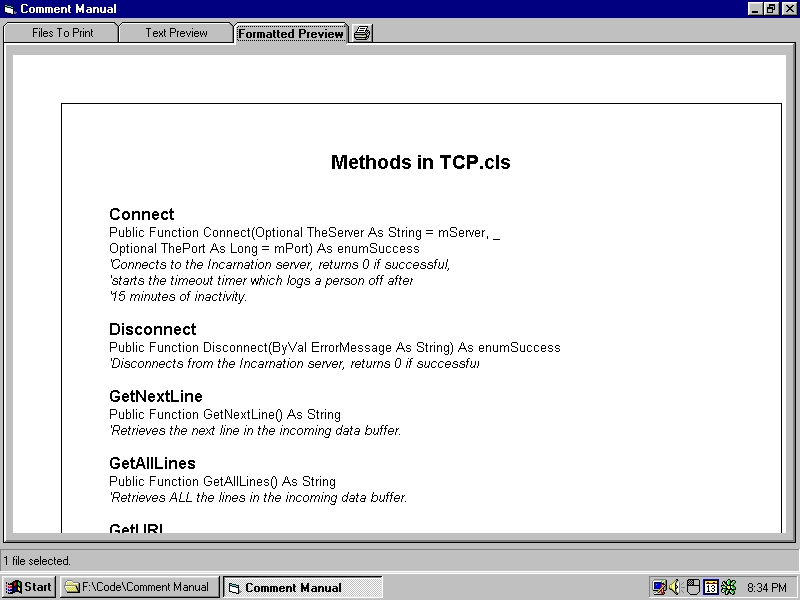



## Comment Manual

### Description

Prints out a 'table of contents' for your Visual Basic program, which contains method names, syntax, and comments only. Useful as 'cover sheets' for the actual code printout.
 
### More Info
 
This doesn't print out your entire code - just the comments, names, and syntax. For a good code printer, go to www.aivosto.com and look at 'Project Analyzer' and 'Project Printer.'

             |
---                |---
**Submitted On**   |2000-09-20 15:33:20
**By**             |[Kamilche](https://github.com/Planet-Source-Code/PSCIndex/blob/master/ByAuthor/kamilche.md)
**Level**          |Beginner
**User Rating**    |4.8 (24 globes from 5 users)
**Compatibility**  |VB 4\.0 \(32\-bit\), VB 5\.0, VB 6\.0
**Category**       |[Miscellaneous](https://github.com/Planet-Source-Code/PSCIndex/blob/master/ByCategory/miscellaneous__1-1.md)
**World**          |[Visual Basic](https://github.com/Planet-Source-Code/PSCIndex/blob/master/ByWorld/visual-basic.md)
**Archive File**   |[CODE\_UPLOAD100269202000\.zip](https://github.com/Planet-Source-Code/kamilche-comment-manual__1-11463/archive/master.zip)

